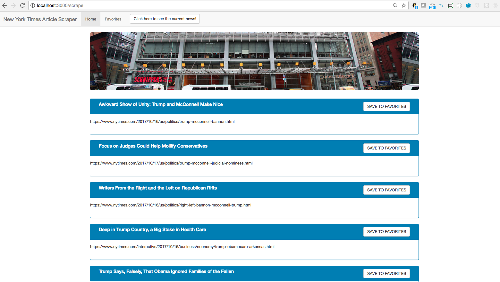

Mongo Post Scrape

Mongo Post Scrape is a web scraping application that scrapes for articles on The New York Times using Node, Handlebars, MongoDB, Cheerio and Mongoose.

Below is a screenshot showing the scraped articles:

